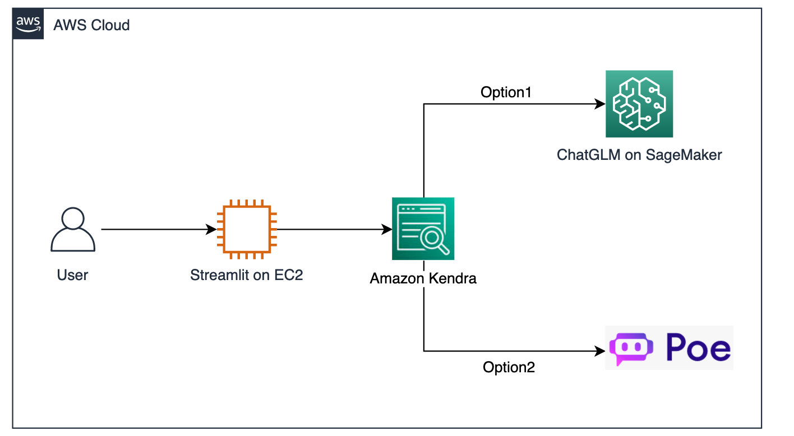

# Amazon Kendra + ChatGLM on SageMaker/Poe 进行中文增强搜索



## 英文增强搜索方案请参考以下链接：
https://aws.amazon.com/cn/blogs/machine-learning/quickly-build-high-accuracy-generative-ai-applications-on-enterprise-data-using-amazon-kendra-langchain-and-large-language-models/

## Installing

Clone the repository
```bash
git clone https://github.com/micxyj/amazon-kendra-langchain-cn.git
```

Move to the repo dir
```bash
cd amazon-kendra-langchain-cn
```

Install the dependencies
```bash
pip install boto3
pip install langchain
pip install streamlit
pip install poe-api
```

Install the classes
```bash
pip install .
```

## Usage

### Creating an Amazon Kendra index and data source
https://docs.aws.amazon.com/kendra/latest/dg/what-is-kendra.html

### Running samples
For executing sample chains, install the optional dependencies
```bash
pip install ".[samples]"
```

### Configure AWS credential
https://docs.aws.amazon.com/cli/latest/userguide/cli-configure-files.html

### If using ChatGLM

#### Deploy ChatGLM on SageMaker
https://catalog.us-east-1.prod.workshops.aws/workshops/1ac668b1-dbd3-4b45-bf0a-5bc36138fcf1/zh-CN/3-configuration-llm/3-1-chatglm

#### Configure env
Ensure that the environment variables are set for the aws region, kendra index id and the provider/model used by the sample.
For example, for running the `kendra_chatGLM.py` sample, these environment variables must be set: AWS_REGION, KENDRA_INDEX_ID
and CHATGLM_ENDPOINT.
You can use commands as below to set the environment variables.
```bash
export AWS_REGION="<YOUR-AWS-REGION>"
export KENDRA_INDEX_ID="<YOUR-KENDRA-INDEX-ID>"
export CHATGLM_ENDPOINT="<YOUR-SAGEMAKER-ENDPOINT-FOR-CHATGLM>"
``` 

#### Running samples from the streamlit app
The samples directory is bundled with an `app.py` file that can be run as a web app using streamlit.
```bash
cd samples
streamlit run app.py chatglm
```

### If using Poe
You must get your Poe token first, you can reference: https://github.com/ading2210/poe-api/tree/main#finding-your-token

Current supported models on Poe: 
- claude
- chatgpt
- sage
- claude+
- gpt4
- claude-instant-100k

You need configure model in env, just like: 
```bash
export POE_MODEL="claude"
```

#### Configure env
```bash
export AWS_REGION="<YOUR-AWS-REGION>"
export KENDRA_INDEX_ID="<YOUR-KENDRA-INDEX-ID>"
export POE_TOKEN="<YOUR-POE-TOKEN>"
export POE_MODEL="<POE-MODEL>"
```

#### Running samples from the streamlit app
The samples directory is bundled with an `app.py` file that can be run as a web app using streamlit.
```bash
cd samples
streamlit run app.py poe
```

### Running samples from the command line
```bash
python samples/<sample-file-name.py>
```

## Uninstall
```bash
pip uninstall aws-langchain
```

## Limit
1. 多轮对话能力弱，会出现中英文混合的问题，主要受限于 LangChain 的 prompt 是由英文构建的；
2. Poe 请求限流。
